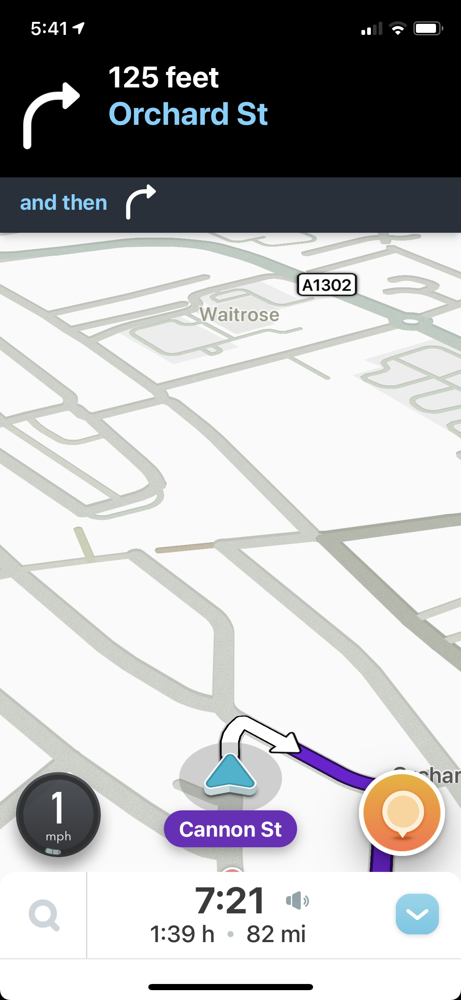

# Diseño de interfaz de usuario

Por el momento solo se tiene la pantalla principal del juego y unos elementos ui menores del mismo pues entre mas funcionalidades se añadan mas van a cambiar y evolucionar estos elementos, la ui del juego esta tambien esta inspirada en aquellos juegos en los que se basa.
1. Pantalla 1: Pantalla principal

# Referencias

- [Material Design: Foundations](https://m3.material.io/foundations)
- [Material Design: Style](https://m3.material.io/styles)
