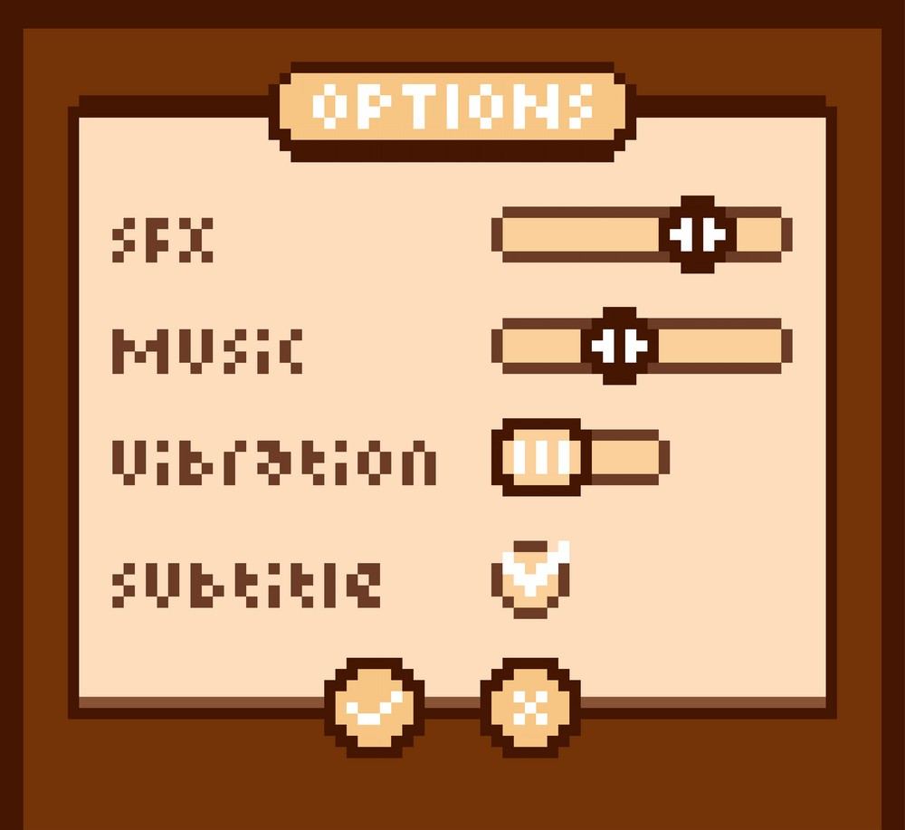

# Diseño de interfaz de usuario

Por el momento solo se tiene la pantalla principal del juego y unos elementos ui menores del mismo pues entre mas funcionalidades se añadan mas van a cambiar y evolucionar estos elementos, la ui del juego esta tambien esta inspirada en aquellos juegos en los que se basa.
1. Pantalla 1: Pantalla principal

2. Pantalla 2: Vida y retrato del personaje

3. Menu de pausa

4. Menu de opciones
nota: esta pantalla esta bloqueada detras de la funcionalidad por ahora

